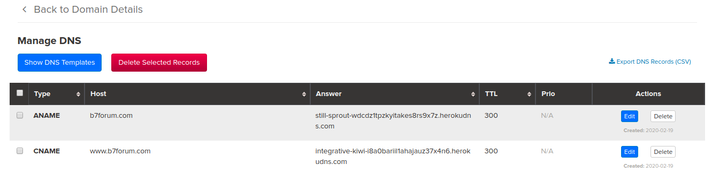

# ChitChat


## Prerequisites

1. Create an account on **Heroku**

2. Install **Heroku CLI** 
    - https://devcenter.heroku.com/articles/heroku-cli

3. Set up **pgAdmin4**
    - Forget it; this tool is uggggh - just go with **DataGrip** instead.


---    


## General Notes
- The project uses Go's new dependency management system.
- For details, see https://blog.golang.org/using-go-modules 
- This walkthrough uses the general approach outlined in:     
    - https://devcenter.heroku.com/articles/preparing-a-codebase-for-heroku-deployment
    - https://devcenter.heroku.com/articles/getting-started-with-go?singlepage=true


## Further reading to enhance the app:
- https://devcenter.heroku.com/categories/go-support
- https://devcenter.heroku.com/articles/oauth2-heroku-go
- https://elements.heroku.com/addons

---

## Setup Steps:

#### Step 1:
- Fork this GitHub repo: https://github.com/mefune/chitchat
- Clone it down to your local machine.

#### Step 2:
- Do search (from top dir in repo) for `mefune` and change to your GitHub account name.

#### Step 3:
- Run `go test`
- Run `go mod tidy` (cleans up unused dependencies).
- Check `go.mod` and `go.sum` files to ensure all looks good.
- `go list -m all`


#### Step 4:
- `heroku create`
- This creates a new empty application on Heroku, along with an associated empty Git repository. If you run this command from your app’s root directory, the empty Heroku Git repository is automatically set as a remote for your local repository.
- `git remote -v`
- `git push heroku master`
- Note, the file `Procfile` tells Heroku which command(s) to run to start your app.


#### Step 5:

Add a free Heroku Postgres Starter Tier dev database to your app:
- `heroku addons:create heroku-postgresql:hobby-dev`

Show the `$DATABASE_URL` environment variable:
- `heroku config`

Heroku also provides a `pg` command that shows a lot more:
- `heroku pg`


#### Step 6:
- Add a `.env` file.
- Note, this file is intentionally in `.gitignore`


#### Step 7:
- Run `heroku config` to get the Heroku app name
- Open that app on your Heroku dashboard: https://dashboard.heroku.com/apps
- Open the PostgreSQL add-on for that app.
- View Credentials on the Settings app.
- Create connection in pgAdmin4 using that info.
    - See https://medium.com/@vapurrmaid/getting-started-with-heroku-postgres-and-pgadmin-run-on-part-2-90d9499ed8fb

#### Step 8:
- Using pgAdmin run the `data/setup.sql` script.


#### Git it on up:
- Note this will be the general flow for working with Git now that we have Heroku remote as well.

```sh
go mod tidy
go mod vendor

git status
git add --all
git commit -a  -m 'Initial launch'
git push heroku master

# Push to GitHub as well:
git push origin master
```

---

### Run your app on **Heroku**:

As a handy shortcut, you can open the website as follows:
- `heroku open`

View information about your running app:
- `heroku logs --tail`


--- 

## Run the app locally:

### Build package:
- See https://golang.org/cmd/go/#hdr-Compile_packages_and_dependencies

```sh
go build -o bin/chitchat -v .
```

- Start your app locally using the `heroku local` command.
    - This is installed as part of the Heroku CLI.
    - Just like Heroku, it examines the `Procfile` to determine what to run.

```sh
heroku local web
```

- Open http://localhost:8080 with your web browser. 
- To stop the app from running locally, go back to your terminal window and press `Ctrl+C` to exit.


---

## Setting Up A Custom Domain For Your Heroku-Hosted App

Note the glossary:
- https://devcenter.heroku.com/articles/custom-domains#domain-name-glossary

Approach taken here is based on:
- https://devcenter.heroku.com/articles/custom-domains
- https://medium.com/@ethanryan/setting-up-a-custom-domain-for-your-heroku-hosted-app-6c011e75aa3d

#### Step 1:
- Buy a custom domain name (I used name.com)
- Example used below is for domain `b7forum.com`

#### Step 2:

```sh
heroku domains:add www.b7forum.com

heroku domains:wait 'www.b7forum.com' 
```

Note the output; configure your app's DNS provider to point to the DNS Target:
- `integrative-kiwi-i8a0bariil1ahajauz37x4n6.herokudns.com`


#### Step 3: Add a custom root domain.

```sh
heroku domains:add b7forum.com

heroku domains:wait 'b7forum.com' 
```

Note the output, configure your app's DNS provider to point to the DNS Target:
- `still-sprout-wdcdz1tpzkyitakes8rs9x7z.herokudns.com`


#### Step 4:
- Add the DNS Records in name.com (or whatever site you bought your domain on).




#### Step 5:
View existing domains:
- `heroku domains`

... Now wait a few minutes ...


---
NOT NEEDED YET:

#### Step ???:
 

- Set your config variables on Heroku.
- Note, `$PORT` is automatically set by Heroku on web dynos - so don't set that one.

`heroku config:set REPEAT=10`
